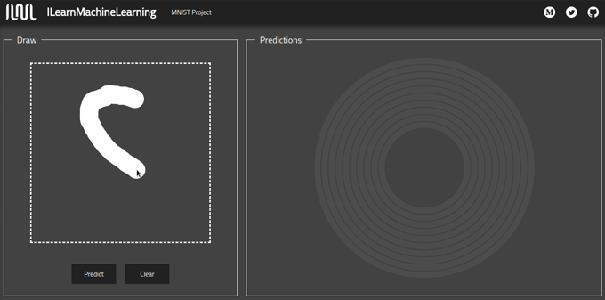
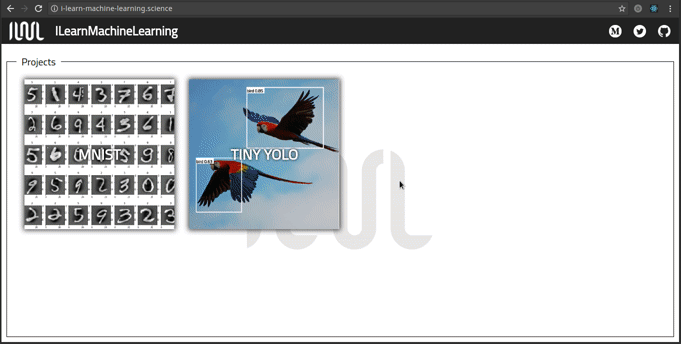

<h1 align="center">TensorFlow.js</h1>

Виконали: Студенти 2 курсу Самойленко Тарас ІО-91 та Миколаєнко Іван ІО-93

## Опис

Завдяки цьому проекту ми змогли поєднати свої знання з двох областей: машинного навчання та веб-розробки. Весь додаток написаний на React за допомогою TypeScript та Redux, але двигун, який його рухає, [TensorFlow.js] [1] - сучасний бібліотека для навчання та розгортання моделей машинного навчання. Ви можете знайти робочий додаток [тут] [2] або пограти з ним на своєму комп’ютері.

``` bash
# install dependencies
npm install

# serve with hot reload at localhost:3000
npm start
```

## MNIST

[MNIST] [3] набір даних широко відомий у галузі машинного навчання. Він містить близько 70000 прикладів рукописних цифр. Фотографії чорно-білі, нормалізовані, щоб поміститися в обмежувальну рамку розміром 28x28 пікселів, і згладжені. Цей знаковий набір даних був використаний для навчання моделі в Keras, а потім перетворений у форму, зрозумілу для TensorFlow.js, і використану як суть першого проекту. Весь процес створення моделі описаний у статті [Medium] [4].

<p align="center"> 

</p>

## YOLO

Спочатку написаний у [Darknet] [5] - фреймворк нейромереж з відкритим кодом - [YOLO] [6] дійсно добре виконує завдання пошуку та розпізнавання об’єктів на малюнках. Після перетворення у форму, зрозумілу для TensorFlow.js, я використовував модель Tiny YOLOv2 для розпізнавання об’єктів на зображеннях, надісланих користувачем. Всі прогнози робляться на стороні клієнта, без необхідності надсилати фотографії на сервер.

<p align="center"> 

</p>

## Створення моделей Keras

Якщо ви зацікавлені в нейронних мережах і хочете знати, як створювати моделі, що використовуються в цьому проекті, ми рекомендуэмо вам протестувати сценарії на своєму комп’ютері.

``` bash
# встановити всі необхідні пакунки та залежності, а також середовище python
./setup.sh

# активувати середовище python
source .env/bin/activate
```

## Докладніше про In-Browser ML

1. [TensorFlow.js Tutorials & Guides][9]
2. [Introducing TensorFlow.js: Machine Learning in Javascript][10]
3. [Neural Network 3D Simulation][11]
4. [YOLO: Real-Time Object Detection][12]
5. [AI Experiments with Google][13]
6. [Gentle guide on how YOLO Object Localization works with Keras][14]
7. [How to implement a YOLO (v3) object detector from scratch in PyTorch: Part 1][15]

[1]: https://github.com/tensorflow/tfjs
[2]: https://learn-machine-learning.herokuapp.com/
[3]: https://js.tensorflow.org/tutorials/
[4]: https://medium.com/tensorflow/introducing-tensorflow-js-machine-learning-in-javascript-bf3eab376db

